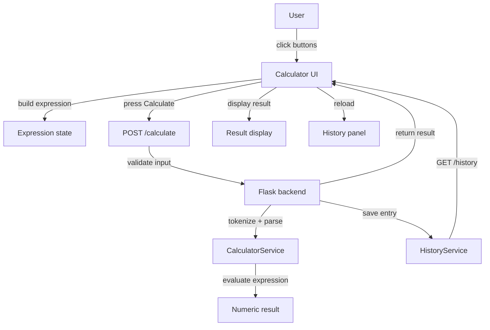
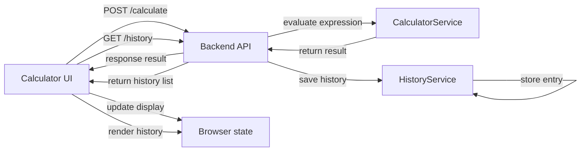

# Broken Calculator

A simple calculator application with a React frontend and Flask backend.

The app supports:
- arithmetic operations: `+`, `-`, `*`, `/`
- exponentiation using `^`
- parentheses for grouping
- history tracking of completed calculations
- a power toggle to turn the calculator on and off

## Project structure

- `frontend/` - React + Vite user interface
- `backend/` - Flask API service and calculation logic

## How it works

1. The frontend renders a calculator UI and loads history.
2. The user enters an expression and clicks **Calculate**.
3. The frontend posts the expression to the backend `/calculate` endpoint.
4. The backend validates and evaluates the expression.
5. If valid, the backend stores the result in history and returns the value.
6. The frontend updates the result and reloads history.

## Local setup

### Backend

```bash
cd backend
python -m venv .venv
.venv\Scripts\activate
pip install -r requirements.txt
python app.py
```

The backend listens on `http://localhost:5000`.

### Frontend

```bash
cd frontend
npm install
npm run dev -- --host 5175
```

Open the app in the browser and use the calculator interface.

## API endpoints

### `POST /calculate`

Request body:

```json
{
  "expression": "2^3 + (4 * 5)"
}
```

Success response:

```json
{
  "result": 28
}
```

Error response:

```json
{
  "error": "Invalid characters in expression"
}
```

### `GET /history`

Returns the recent calculation history in reverse order.

### `DELETE /history`

Clears all stored history entries.

## Review of existing README

The existing `frontend/README.md` is a generic Vite template and does not describe this calculator project. It should be replaced with this project-specific documentation or supplemented by a root-level README so developers and reviewers understand app behavior, setup, and API details.

## Diagram source files

- `diagrams/mermaid.js` — JavaScript source for the logic flow and dataflow diagram strings.
- `diagrams/dataflow.mmd` — standalone Mermaid dataflow diagram source.

## Application logic flow



## Data flow diagram


